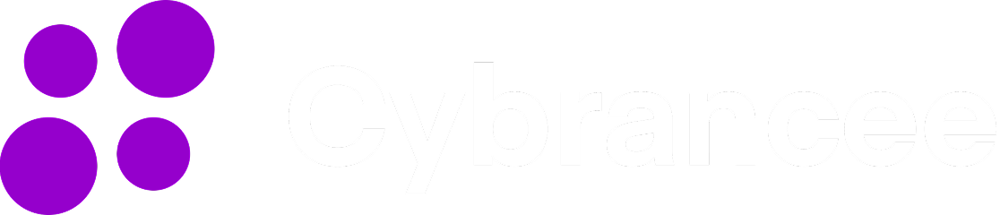

# Hosting Providers

S1DedicatedServers is an open-source project. Players can self-host it directly, use the official Docker package, or rent a hosted server from a provider that supports the mod.

This page is the source of truth for supported hosted-provider guidance. Providers not listed here should be treated as independent third-party hosts.

Some provider links may be affiliate links. Using them can support continued S1DedicatedServers development, but commercial hosting is optional and never required to use the mod.

## Supported Providers

Want a hosted server instead of running the dedicated server yourself? The providers below support S1DedicatedServers. Cybrancee is the recommended option and the provider used for ongoing hosted-server validation.

  <section id="cybrancee" class="hosting-provider-primary" aria-label="Cybrancee supported provider">
    

      

        
Supported provider

        
      

      

        

          Confirmed for supported hosting, with an ongoing maintainer
          test server available for future S1DedicatedServers updates.
        

        

          <a class="hosting-provider-button" href="https://cybrancee.com/bars">Visit Cybrancee</a>
        

      

    

  </section>

  <section id="kinetic-hosting" class="hosting-provider-secondary" aria-label="Kinetic Hosting supported provider">
    

      

        
Supported provider

        
      

      

        

          Confirmed working during maintainer setup testing and listed as a
          compatible hosted option for S1DedicatedServers.
        

        

          <a class="hosting-provider-button" href="https://billing.kinetichosting.com/aff.php?aff=1417">Visit Kinetic Hosting</a>
        

      

    

  </section>

  <section id="respawnhost" class="hosting-provider-secondary" aria-label="RespawnHost supported provider">
    

      

        
Supported provider

        
      

      

        

          RespawnHost supports S1DedicatedServers from locations in Frankfurt and
          Salt Lake City. Players in Germany may prefer its German-language service
          and nearby Frankfurt location.
        

        

          <a class="hosting-provider-button" href="https://rspwn.click/bars">Visit RespawnHost</a>
        

      

    

  </section>

## Self-Hosting

Self-hosting remains the baseline deployment path. Use the release packages and docs below when you want to control the install directly:

- [Quick Start](../index.md)
- [Docker Deployment](docker.md)
- [Configuration Overview](configuration.md)
- [Startup and Deployment](configuration/startup-and-deployment.md)

## Third-Party Hosting

Hosting providers other than Cybrancee, Kinetic Hosting, and RespawnHost may advertise Schedule I or S1DedicatedServers-compatible hosting. These providers operate independently and may use their own panels, packaging, update timing, support processes, and compatibility assumptions.

Unless this page lists a provider as recommended or verified, do not treat third-party listings, provider documentation, control-panel templates, bundled installs, or customer support claims as project verification or endorsement.

Before buying hosted service, compare the details that affect real server quality:

- **Runtime support:** confirm which S1DedicatedServers version is installed and whether the provider supports Mono, IL2CPP, or both. Public provider pages may not state this clearly, even when the provider supports Schedule I or general game hosting.
- **CPU performance:** prioritize modern high-clock CPUs. Schedule I dedicated servers are more sensitive to CPU speed than raw RAM once you have enough memory for your player count and mods.
- **RAM sizing:** choose more RAM for larger communities, heavier saves, and more mods. RAM matters, but extra RAM will not fix a weak CPU or overloaded node.
- **Storage and backups:** prefer NVMe storage, visible file access, and clear backup/restore controls for saves, configs, and logs.
- **Panel access:** confirm you can access logs, `server_config.toml`, `permissions.toml`, save files, and a supported operator surface such as the stdio host console or a host-provided console.
- **Updates:** ask how quickly new S1DedicatedServers releases are packaged and whether you can manually upload or pin a version.
- **Networking:** confirm the required gameplay, status query, and Steam query/listing ports can be exposed.
- **Locations and routing:** choose the closest region to your players, and check whether the provider publishes location or ping-test information.
- **Support and reputation:** review the provider's support channels, response expectations, refund policy, status page, and recent public reviews before committing.

Public provider notes:

- **Cybrancee:** publicly advertises game servers on Ryzen CPUs over 4GHz with NVMe SSDs, a customized Pterodactyl panel for game hosting, DDoS protection, backups, international locations, 24/7 support, and a 90-day money-back guarantee. Its Trustpilot profile is currently rated 4.8 Excellent.
- **Kinetic Hosting:** publicly lists Schedule 1 among supported games and advertises performance packages with NVMe SSDs, up to Ryzen 9 9950X at 5.7GHz, 6-8 CPU threads on common 8GB/16GB packages, default 60GB storage with free storage upgrades under fair use, backups, split servers, game swapping, a custom panel, 15 locations, 24/7 human support, public node stats, and a 7-day refund window. Its Trustpilot profile is currently rated 4.8 Excellent.
- **RespawnHost:** publicly advertises pay-per-use game servers, NVMe storage, backups, file and SFTP access, mod integration, and locations in Frankfurt and Salt Lake City. Its German-language service and Frankfurt location may make it a preferable option for players in Germany.

Because provider pages change, verify current package specs and S1DedicatedServers runtime support with the provider before purchase.

For hosted control panels, [Host Console](host-console.md) is usually the right operator path.

## For Commercial Hosting Providers

If you offer commercial S1DedicatedServers hosting, you are welcome to contact the project maintainer for setup guidance, version coordination, or partnership and affiliate options.

Attribution and links to the project are optional, but appreciated. If you choose to provide attribution, use `S1DedicatedServers` / `DedicatedServerMod` by `ifBars` and link to the official releases or documentation.

We also recommend keeping bundled builds current with public releases and showing customers the installed runtime and version.

Commercial providers must not imply supported-provider, recommended, affiliate, sponsor, official, or exclusive status unless a written arrangement exists.

### Game Update Invariant

For every Schedule I update, stop the server before touching its files, then follow this order: update or validate the game, reapply the pinned MelonLoader version, delete only `MelonLoader/Dependencies/Il2CppAssemblyGenerator/Cpp2IL/cpp2il_out`, reapply the DedicatedServerMod release files, then start the server. This prevents stale Cpp2IL output from a prior game build from being passed to Il2CppInterop. Do not use a MelonLoader downgrade as the primary recovery; inspected `0.7.0` through `0.7.3` releases share this behavior, while a reinstall often appears to help only because it removes `cpp2il_out`.

Partnership, affiliate, sponsorship, supported-provider, and recommended-host placements should be disclosed clearly wherever they appear.

## Related Documentation

- [Host Console](host-console.md)
- [Docker Deployment](docker.md)
- [Startup and Deployment](configuration/startup-and-deployment.md)
- [Configuration Overview](configuration.md)
- [Troubleshooting](troubleshooting.md)
